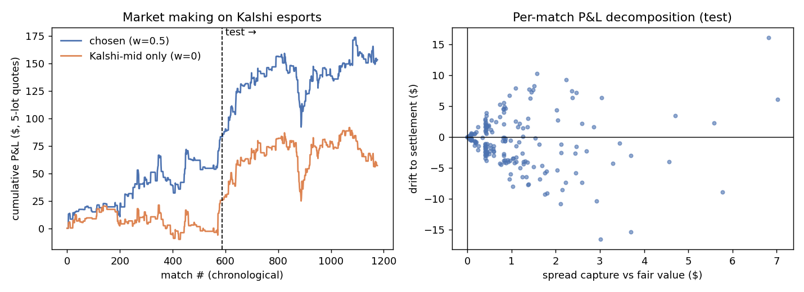

# esports-arb

A fee-aware, depth-aware **arbitrage scanner for esports match-winner markets**.
It covers League of Legends, CS2, Valorant, Rainbow Six Siege, Rocket League,
Overwatch, Dota 2 and Call of Duty, on these venues:

| Venue | Data | Auth |
|---|---|---|
| **Kalshi** (CFTC-regulated exchange) | public REST: events + full order books | none |
| **Polymarket** (CLOB) | Gamma API for discovery, CLOB `/books` for depth | none |
| **Sportsbooks** (Pinnacle, bet365, Stake, ...) | [OddsPapi](https://oddspapi.io) aggregator | `ODDSPAPI_KEY` (optional) |
| **Any other book** (DraftKings, FanDuel, ...) | paste odds into a JSON file (`--manual`) | none |

For each match, the scanner:

1. Finds the same match on every venue, even when team names differ.
2. Converts every quote to a *price per $1 of payout*.
3. Checks every way of being long team A against every way of being long
   team B.
4. Sizes the trade by walking both order books together.
5. Subtracts each venue's real fee schedule.

It reports only trades that still make money after all of that, with warnings
for the risks that make an "arb" less than risk-free.

---

## How the arbitrage works (short version)

A match has two outcomes. $1 of "A wins" plus $1 of "B wins" **always pays exactly $1**.

```
profit per $1 = 1 − ask_A − ask_B − fee(ask_A) − fee(ask_B)
```

If that number is positive, buy both legs in equal size and the profit is
locked in, whoever wins.

* **Kalshi** gives two ways to be long A: `YES on "A wins"` or `NO on "B wins"`.
  The scanner checks both.
* **Fees** (both scale with `P(1−P)`, so they are largest for 50/50 matches):
  * Kalshi: `ceil_to_cent(0.07 · C · P · (1−P))`
  * Polymarket sports: `0.05 · C · P · (1−P)`, charged to takers only
  * Sportsbooks: no separate fee; the margin is already built into the odds
    (decimal odds `d` → price `1/d`)
* **Sizing:** `walk_books` merges the two ask ladders and keeps buying while
  the *marginal* pair still costs less than $1 after fees. That gives the
  profit-maximizing size. The result is then capped by `--bankroll` and
  rounded down to whole contracts.
* **Not actually risk-free:** if a match is cancelled, Kalshi resolves to
  "fair price", Polymarket resolves 50-50, and sportsbooks refund the stake.
  Each opportunity therefore shows an estimated `if cancelled` P&L, plus flags
  for fuzzy name matches, live matches, and sizes below a venue's minimum
  order.

The full derivation is in **[docs/METHODOLOGY.md](docs/METHODOLOGY.md)**.
Interview-style Q&A is in **[docs/INTERVIEW.md](docs/INTERVIEW.md)**.

## Architecture

```
esports_arb/
├── games.py            per-game ids on each venue (KXLOLGAME / series 10311 / sportId 18 ...)
├── models.py           Leg (one way to be long a team), Match, Opportunity
├── connectors/
│   ├── kalshi.py       events → 2 markets → 4 legs; asks rebuilt from opposite-side bids
│   ├── polymarket.py   moneyline markets + batched CLOB order books
│   ├── oddspapi.py     sportsbook decimal odds → price legs
│   └── manual.py       pasted American/decimal odds
├── normalize.py        team-name folding, aliases, roster-aware fuzzy match
├── matcher.py          cluster the same match across venues (names + ±6h start window)
├── fees.py / odds.py   fee schedules; odds conversion; multiplicative & Shin de-vig
├── arb.py              top-of-book edge, depth walk, exact fees, cancelled-match P&L
├── scanner.py          fetch → cluster → cheap screen → load depth → evaluate all leg pairs
├── cli.py              scan / near-misses / record / stream / mm-data / mm-backtest / mm-paper / mm-live
├── streaming/          real-time market data
│   ├── books.py        L2 books from snapshots + incremental updates (Kalshi YES/NO bids, Polymarket levels)
│   ├── polymarket_ws.py  public CLOB websocket: subscribe, PING keepalive, reconnect + resubscribe
│   ├── kalshi_ws.py    authenticated websocket: orderbook_delta + trades, seq-gap detection -> resync
│   ├── kalshi_poll.py  no-key fallback: batched top-of-book polling (≈100 markets per request)
│   ├── hub.py          re-evaluates only the match whose book changed; logs arb episodes (ms)
│   └── feed.py         background-thread feed that drives the market maker event by event
└── mm/                 market making on Kalshi
    ├── quoting.py      fair-value blend, inventory skew, post-only clamp (shared by backtest + live)
    ├── book.py         positions, settlement, capture-vs-drift P&L decomposition
    ├── data.py         settled-match dataset: Kalshi trade tape + candles, Polymarket history
    ├── backtest.py     event-driven replay with trade-through fill model
    ├── kalshi_client.py  RSA-PSS signed Kalshi API (orders, fills, positions)
    └── live.py         paper/live loop with exposure caps, max-loss halt, STOP kill switch
scripts/analyze.py      research on recorded snapshots (edge distribution, basis, AR(1) half-life)
scripts/mm_research.py  walk-forward MM parameter search, out-of-sample test, robustness
scripts/series_research.py consistency, correlation, calibration, walk-forward + executable-fill test
scripts/stream_analyze.py  arb-episode persistence (Kaplan–Meier), who opens/closes each arb
scripts/validate_stream.py checks streamed books against REST snapshots
```

## Quick start

```bash
pip install -r requirements.txt            # requests (+ cryptography for live Kalshi trading)
python -m esports_arb scan                  # all games, Kalshi + Polymarket (+ books if key set)
python -m esports_arb scan -g lol,r6,rl,ow --min-edge 0.005 --bankroll 250 --json arbs.json
python -m esports_arb near-misses --limit 20   # closest cross-venue pairs, even if edge < 0

export ODDSPAPI_KEY=...                     # optional: add sportsbooks
python -m esports_arb scan --manual data/manual_odds.example.json   # or paste odds

# research
python -m esports_arb record --interval 60 --iterations 60 --out data/snapshots.csv
pip install -r requirements-dev.txt
python scripts/analyze.py data/snapshots.csv --out docs
pytest -q
```

Example output (live, 2026-09-15):

```
177 matches, 87 listed on 2+ venues, 2 opportunities

#1 [cs2] M80 vs NIP  (start Sep 17 09:00Z)
    leg A: long M80: kalshi NO on "NIP wins" @ 0.450   (≈ decimal 2.22)
    leg B: long NIP: polymarket "NIP" token @ 0.510   (≈ decimal 1.96)
    top-of-book edge 1.02% | size 1 | cost $0.99 (fees $0.03) | profit $0.01 | ROI 0.76% | ann. 140%
    if cancelled: est. P&L $-0.04
    ! size 1 is below venue minimum order (5)
    ! void-rule mismatch: kalshi='... fair market price' vs polymarket='... resolves 50-50'
```

## Results: 44 minutes of live Kalshi and Polymarket quotes

`esports_arb record` saved the best asks every 60s for 44 minutes on
2026-09-15 (15:00–15:44 UTC): 45 snapshots, 23,347 quotes, **87 matches listed
on both venues** (CS2, LoL, R6, Valorant, Dota 2, Rocket League; no Overwatch
or CoD matches were open). The raw data is in `data/snapshots.csv.gz`, and
`python scripts/analyze.py data/snapshots.csv.gz` reproduces everything below.


| Metric | Value |
|---|---|
| Match-snapshots where the best cross-venue pair costs < $1 (**gross arb**) | **12.9%** (28 of 87 matches at some point) |
| ... still < $1 **after taker fees** (**net arb**) | **2.8%** (7 matches: 6 CS2, 1 Rocket League) |
| Net edge percentiles | p50 −378bp · p95 −32bp · p99 +348bp |
| Median net edge when positive | 102bp |
| Median top-of-book size when positive | **1 contract** |
| How long a net arb lasts (consecutive snapshots) | median 3 min, mean 10.9, max 45 (the whole window) |
| Kalshi − Polymarket basis (de-vigged P) | mean −0.55pp, mean \|basis\| 1.89pp, p95 7.73pp |
| Median overround (ask A + ask B − 1) | Kalshi 3.0% · Polymarket 2.0% |
| Basis AR(1) | φ = 0.957 → half-life ≈ 16 min |

What this says:

1. **The two venues agree closely on who wins** (right-hand plot), but they
   regularly differ by several points on smaller matches. Those differences
   fade slowly, with a half-life of about 16 minutes rather than seconds. That
   is what you'd expect from thin, slow-moving markets.
2. **Fees remove about 80% of the apparent arbs.** 12.9% of match-snapshots
   show a gross arb, but only 2.8% survive fees. The gaps that fees wipe out
   are usually a single cent (median gross edge 1c). That is less than the
   2–3c the two venues charge together on mid-priced legs, where `P(1−P)` is
   largest.
3. **The arbs that survive can't be traded at meaningful size.** The typical
   one has **one contract** at the top of the book, which is below
   Polymarket's 5-share minimum. The biggest persistent edge (Rocket League,
   about 3.5%, shortly before the match started) had 0.08 contracts on offer.
   A taker-taker arb bot here earns cents.
4. **The Kalshi NO leg matters.** Most net-positive pairs used `NO on
   "opponent wins"` rather than `YES on team`. A scanner that only checks YES
   contracts would miss them.
5. **Takeaway:** the durable opportunity is **market making**, not taking.
   Quote passively on the thin venue near the other venue's price, and hedge
   on the other venue when filled. That avoids one taker fee (Polymarket even
   pays makers a rebate) and captures the slow-reverting basis. It is the
   natural next step for this project.


## Part 2: market making (where the durable edge is)

Taking both sides of an arb earns cents. Quoting passively can earn more. The
`mm/` package **makes markets on Kalshi**, where esports series have no maker
fee, around a fair value that blends Polymarket's and Kalshi's mids. It skews
quotes against inventory and stops quoting 2 hours before each match.



The backtest used 1,177 settled matches, replayed against Kalshi's real trade
tape. Settings were chosen on the first half of the matches and tested on the
second:

| Out-of-sample (589 matches) | |
|---|---|
| P&L, 5-lot quotes | **+$70.11** (t = 1.12) |
| Per contract | +2.8c (spread capture +8.5c, adverse selection −5.7c) |
| Same settings, Kalshi-mid only | +$31.63 |
| Quoting in the last 2h before a match | **−6.2c per contract** (informed flow) |

The edge is positive but not statistically significant, and it is sensitive
to latency. Full method, tables and caveats are in
**[docs/MARKET_MAKING.md](docs/MARKET_MAKING.md)**.

```bash
python -m esports_arb mm-data --days 21                  # build the dataset (~20 min)
python scripts/mm_research.py data/mm/dataset.json.gz     # walk-forward research
python -m esports_arb -v mm-paper --minutes 120           # paper-trade on live books
python -m esports_arb -v mm-live --confirm-live ...       # your own Kalshi API key; see docs
```

## Part 3: streaming (millisecond view)

`python -m esports_arb stream` keeps live order books over WebSockets. It
always streams Polymarket. It streams Kalshi when you set an API key, and
otherwise polls Kalshi's top of book every second. Every book change
re-checks only the affected match (about 33 µs per check), and each arb is
logged as an **episode** with a millisecond lifetime.


Results from 45 minutes across 108 matches:

- **Total:** 129 episodes, each profitable after fees.
- **Lifetimes:** median 0.6s, and 97% were gone within 60s. A
  once-a-minute poller therefore never sees most arbs.
- **In-play episodes (121):** nearly all were opened by a Polymarket update.
  Their lifetimes cluster at the Kalshi poll interval, so most are stale
  quotes rather than tradable edge.
- **Pre-match episodes (8):** rare, a few contracts each, and some lasted
  minutes.

The book checks, method and caveats are in
**[docs/STREAMING.md](docs/STREAMING.md)**. The market maker can use the
same feed (`mm-paper --stream`) to requote whenever a book moves.

## Part 4: series-format consistency (match vs maps vs handicap vs totals)

A best-of-3 can end only six ways, so each match, map, handicap and totals
contract is a payoff vector over those six outcomes. `series-scan` solves a
linear program for the **cheapest basket across both venues that pays at
least $1 however the series goes**. Any basket costing under $1 after fees
is an arbitrage.


- **Live (2026-09-16):** across 132 matches, it found a Polymarket-only
  Dota 2 basket (games 1 & 2, under 2.5, +1.5 handicap) that pays exactly
  $1,500 in every outcome for $1,407.57, a profit of **+$92 (6.6%)**.
- **History (2,273 settled BO3s):**
  - **Maps are correlated:** 2-0 results happened 59.8% of the time, versus
    54.7% if maps were independent.
  - **The handicap market adds almost nothing:** it predicts worse than
    simply multiplying the two map prices.
  - **Betting that mispricing:** +22.6¢ per bet out of sample (t = 5.1) at
    midpoint prices. But only 8 of 107 signals could actually have been
    filled, because those books are mostly empty.
- **So:** for the handicap and totals mispricing, post limit orders rather
  than taking. Scan for true arbitrage baskets with the LP.

Details: **[docs/SERIES.md](docs/SERIES.md)**.

```bash
python -m esports_arb series-scan
python -m esports_arb series-data --days 45 && python scripts/series_research.py data/series/history.json.gz
```

## Limitations and next steps

* Kalshi's websocket needs an API key. Without one, the stream polls Kalshi's
  top of book every second, so arb lifetimes near 1s are bounded by that
  poll (see [docs/STREAMING.md](docs/STREAMING.md)).
* The arb scanner models taker-taker trades only. The market maker (part 2)
  quotes on one venue, and does not yet hedge fills on a second venue.
* The arb scanner and market maker trade match-winner markets only. Map,
  handicap and totals markets are covered by `series-scan` (Part 4), which
  doesn't execute trades.
* Sportsbook sizes are assumed (`--book-limit`), because books don't publish
  depth. The OddsPapi connector is covered by unit tests on recorded payloads
  but needs your own key to run live.
* Not investment advice. Check each venue's terms and your jurisdiction.
  Polymarket's international exchange is geofenced for US users.
