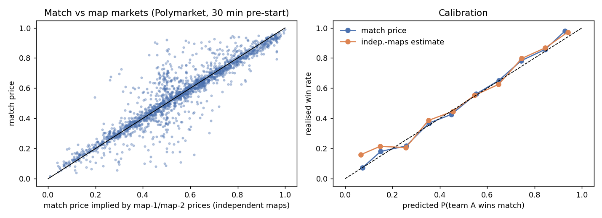

# Series-format consistency: match vs maps vs handicap vs totals

## The idea

A best-of-3 can only end six ways: **AA, ABA, ABB, BAA, BAB, BB**. Every
series contract on either venue pays according to which of those sequences
happens:

| Contract | AA | ABA | ABB | BAA | BAB | BB |
|---|---|---|---|---|---|---|
| A wins match | 1 | 1 | 0 | 1 | 0 | 0 |
| A wins map 1 | 1 | 1 | 1 | 0 | 0 | 0 |
| A wins map 2 | 1 | 0 | 0 | 1 | 1 | 0 |
| A wins map 3 (Polymarket: 50-50 if unplayed) | ½ | 1 | 0 | 1 | 0 | ½ |
| A −1.5 maps (A wins 2-0) | 1 | 0 | 0 | 0 | 0 | 0 |
| Over 2.5 maps | 0 | 1 | 1 | 1 | 1 | 0 |

This table implies some **exact identities**: two baskets of contracts that
pay the same in every sequence, so their prices must agree.

```
Over + 2·(A −1.5)  =  (A map 1) + (A map 2)
A match            =  ½·(A map 1) + ½·(A map 2) + (A map 3) − ½     (Polymarket map-3 rule)
(A −1.5) + (B −1.5) + Over = 1
```

The table also implies **bounds**: `A −1.5 ≤ A match ≤ A −1.5 + Over`.

When prices break one of these by more than fees, a basket of contracts pays
at least $1 in **every** sequence for less than $1. That is an arbitrage,
not a prediction.

## Finding the baskets: a linear program (`series/lp.py`)

Rather than hard-coding identities, the scanner treats every quote as a
payoff vector over the six sequences and solves:

```
minimise   Σ cost_j · x_j                       cost_j = ask + taker fee
s.t.       Σ payoff_j(s) · x_j ≥ 1   for every sequence s,   x_j ≥ 0
```

If the optimum is below 1, the solution *is* the basket. The LP can combine
any number of contracts across **both venues**: Polymarket's match,
map/game, handicap and totals markets, and Kalshi's `*GAME`, `*MAP-n` and
`*TOTALMAPS` markets. BO3 and BO5 are both supported (a BO5 has 20
sequences).

After solving:

* **Size:** each leg walks its order book. Profit as a function of basket
  size is concave, so the best size is found by checking every point where
  some leg's price level changes. Quantities are rounded up to tradable lots,
  which can only raise payoffs. Fees are then recomputed exactly.
* **Unknown settlement is treated as a loss.** Kalshi settles an unplayed
  map 3, or a cancelled match, at an unspecified "fair market price", so the
  LP counts those payoffs as **$0**. It never relies on them.
* **Warnings:** each basket reports its payout if the match is cancelled
  (Polymarket pays 50-50 on everything), which legs fall below a venue's
  minimum order, whether legs are on two venues, and whether the match is
  already live.

```bash
python -m esports_arb series-scan            # all games, both venues
python -m esports_arb series-scan -g dota2,cs2 --bankroll 500 --near 20
```

### Live scan (2026-09-16)

The scan covered 132 best-of-N matches (63 on both venues) and 2,309
contract quotes, and found 3 baskets (full output in
[series_scan_sample.txt](series_scan_sample.txt)).

The largest was a **Polymarket-only Dota 2 basket**:
* **Legs:** 500 × Dawn Bulls game 1, 500 × Dawn Bulls game 2, 500 × Under
  2.5 games and 1,000 × Zero Tenacity +1.5.
* **Why it pays:** it pays exactly $1,500 whichever way the series goes, and
  costs $1,407.57 including fees, for **+$92 (6.6%)**.
* **Why the prices were wrong:** the handicap market priced "Dawn Bulls
  2-0" at ~50%, while the match market priced Dawn Bulls winning *at all* at
  ~50%. That implies a 2-1 win was impossible.
* **Risk:** this match had already been postponed once. If it is cancelled,
  the basket returns $1,250.

The other two baskets were a live Rocket League match (0.8%) and a 1-cent
cross-venue basket.

## Is betting the *inconsistency* +EV? A historical study

`scripts/series_research.py` looked at 2,273 settled Polymarket BO3s over 45
days (CS2 1,391, LoL 387, Valorant 258, Dota 2 237), using prices 30 minutes
before start. Exact 0.50 prices were dropped, because Polymarket reports a
0.50 midpoint for a book with no orders; 12–18% of handicap and totals
prices were exactly 0.50. Full output is in
[series_results.txt](series_results.txt).



**1. The markets are often inconsistent at midpoint prices.**
* The identity `Over + 2·H = W1 + W2` is off by more than 3pp in 56% of
  matches, and by more than 6pp in 33%.
* The bound `H_A ≤ M ≤ H_A + Over` is broken in 4% / 3% of matches.
* The identity basket, priced at mid + 1¢ + fees, would have been profitable
  in 24% of matches. This is at *midpoint* prices, which are not tradable.

**2. Maps are not independent.**
* 2-0 results happened 59.8% of the time, versus 54.7% if map 1 and map 2
  were independent.
* The market's own estimate (1 − Over) is 58.3%: it prices most, but not
  all, of that correlation.

**3. Which price is right when they disagree?**

| Target | Market price Brier | Estimate from other markets |
|---|---|---|
| Match winner | **0.1942** | 0.2019 (independent maps) |
| Over 2.5 | 0.2396 | **0.2389** (independent maps) |
| A wins 2-0 | 0.1994 | **0.1922** (map 1 × map 2) |

The match market is the most accurate of all these prices. The
**handicap market is worse than simply multiplying the two map prices**: in
a logistic fit, its own price gets a coefficient of 0.01, so it adds almost
nothing.

**4. Walk-forward betting test.**
* **Method:** fit on the first half. Choose the threshold by 5-fold
  cross-validation on that half. Test once on the second half. Cost is
  price + 1¢ + taker fee.
* **Executable re-check:** each test bet is then re-run using only prices
  someone actually paid: a taker must have bought that side between the
  decision and the start, at a price where the bet is still +EV.

| Strategy | Test bets (at mid) | P&L | Executable fills | Executable P&L |
|---|---|---|---|---|
| Match price vs independent maps | rejected in training | — | — | — |
| Over 2.5 vs independent maps | 208 | **+5.6¢/bet** (t = 1.71) | 6 of 208 | +9.6¢/bet (t = 0.43) |
| Over 2.5 vs identity | rejected in training | — | — | — |
| A 2-0 vs map 1 × map 2 | 107 | **+22.6¢/bet** (t = 5.13) | **8 of 107** | +36¢/bet (t = 2.41) |

What this means:

1. **Handicap and totals markets are genuinely mispriced**, and a simple
   map-price model beats them out of sample.
2. **You mostly can't take the edge.** 92–97% of the signals never had a
   single taker trade on the needed side before the match: these books are
   empty or stale. The few fills that did happen were profitable, but 6–8
   bets prove nothing.
3. **Posting limit orders beats taking.** Rest quotes in the thin handicap
   and totals books at the model price (fair value from the match and map
   markets, adjusted for the ~5pp 2-0 correlation). Polymarket charges
   makers nothing and pays a rebate. This reuses the `mm/` engine with a
   different fair-value function and is the natural next step.
4. **True arbitrages (the LP) are rare but real.** Today's scan found one
   worth $92. `series-scan` prices baskets at real asks and full book depth,
   not at midpoints.

## Caveats

* **Polymarket history prices are mids or last trades, not asks.** That is
  why the executable re-check exists.
* **Start times:** Polymarket's scheduled start can differ from the real
  one. The re-check only uses trades before the scheduled start, and fills
  in the last minutes could still be in-play.
* **Settlement rules can change legs' payoffs.** Forfeits, walkovers,
  postponements past 14 days, and Kalshi's "fair value" rule can all make a
  leg pay something other than the table above. The LP treats unknown
  payoffs as $0, and cancellation P&L is reported separately.
* **This is not financial advice.** Check venue terms and your jurisdiction;
  Polymarket's international exchange blocks US users.
