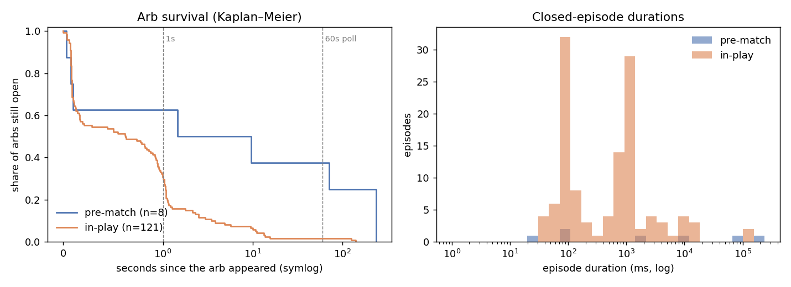

# Streaming market data

The original scanner polled REST endpoints once a minute. This module keeps
**live order books over WebSockets** and re-checks for arbitrage every time
a book changes. That makes it possible to measure how long an arb actually
lasts, down to the millisecond.

## Feeds

| | Polymarket | Kalshi (API key) | Kalshi (no key) |
|---|---|---|---|
| Transport | `wss://ws-subscriptions-clob.polymarket.com/ws/market` | `wss://external-api-ws.kalshi.com/trade-api/ws/v2` | REST `GET /markets?tickers=…` |
| Auth | none | RSA-PSS headers, signing `ts + GET + /trade-api/ws/v2` | none |
| Book data | `book` snapshots + `price_change` (new total size per level) | `orderbook_snapshot` + `orderbook_delta` (signed size change) | top of book, polled every 1s (about 100 markets per request) |
| Integrity | new `book` snapshot after trades; `ready` flag reset on disconnect | per-subscription `seq`; a gap raises `SeqGap` and the client resubscribes for fresh snapshots | an unchanged poll still refreshes the book's timestamp; books older than 3 polls are ignored |
| Keepalive | text `PING` every 10s; reconnect if no data for 30s | protocol-level ping/pong | — |
| Reconnects | exponential backoff (1s → 30s), full resubscribe | same | — |

Kalshi's WebSocket rejects connections without an API key (HTTP 401, even
for public channels). So `esports_arb stream` uses the WebSocket when
`KALSHI_KEY_ID` and `KALSHI_PRIVATE_KEY_PATH` are set, and falls back to
the batched poller otherwise. When the poller spots an edge, the hub fetches
full Kalshi depth for sizing (at most once per market every 5s).

## Event-driven evaluation (`streaming/hub.py`)

* Every instrument maps to the matches that contain it. An update
  re-evaluates only those matches, using the same fee-aware, depth-walking
  `arb.evaluate` as the REST scanner. That averages **~33 µs per update**,
  keeping up with roughly 300–440 Polymarket messages per second on one core.
* An **episode** is the time one leg pair stays profitable after fees. It
  opens on the first update where the edge is above `--min-edge` and closes
  on the first update where it isn't. Each episode records its start time,
  duration in ms, which venue's update opened and closed it, its peak edge
  and size, the age of the oldest Kalshi book it relied on, and whether the
  match was already **in play**.
* Episodes still open at shutdown are written as right-censored. The
  analysis uses a Kaplan–Meier survival estimate so they aren't dropped or
  counted as closed.

## Checking the books are right (`scripts/validate_stream.py`)

Books built from incremental updates can drift from the exchange's true
book, so two checks were run over 120s on 200 Polymarket books:

| Check | Result |
|---|---|
| Each new `book` snapshot vs the book maintained from `price_change` updates | 96 / 102 identical (94%) |
| Maintained book vs a REST snapshot taken at the same moment, top 5 levels | 191 / 200 identical (95.5%) |
| Same, entire book | 174 / 200 (87%) |

In every mismatch we inspected, the prices matched and only the resting size
at one level differed, right after a trade. Polymarket corrects this with the
next `book` snapshot. For execution, re-check size at the moment of trading.

## Results: 45 minutes, 108 matches (2026-09-16 14:54–15:39 UTC)

Feeds for this run: Polymarket over its WebSocket (216 books,
~290–440 msg/s) and Kalshi polled every 1s, because this session has no
Kalshi key. Episodes were logged at any edge above zero after fees
(`python scripts/stream_analyze.py data/stream/episodes.jsonl`).



| | Pre-match | In-play |
|---|---|---|
| Episodes (matches) | 8 (3) | 121 (6) |
| Median lifetime (Kaplan–Meier) | **1.5 s** | **0.6 s** |
| Shorter than 1s / 5s / 60s | 43% / 57% / 71% | 69% / 92% / 98% |
| Longest | ~4.0 min | ~2.3 min |
| Opened by a Polymarket update | 6 of 8 | 113 of 121 |
| Closed by Polymarket / Kalshi update | 6 / 1 | 63 / 58 |
| Peak edge per $1, median / p90 | 0.12% / 2.83% | 0.34% / 1.99% |
| Peak executable size, median | 7 contracts | 10 contracts |
| Peak $ profit, sum over episodes | $0.27 | $41.36 |

### What this says

1. **Minute-level polling badly misses how long arbs last.** 97% of episodes
   ended within 60s, and most in-play ones within one second. The earlier
   REST study could only see the rare long-lived dislocations.
2. **The durations cluster in two groups: about 0.1s and about 1s.**
   * The ~1s group matches the Kalshi poll interval. During a live match,
     Polymarket reprices first (113 of 121 in-play episodes were opened by a
     Polymarket update), and the "arb" lasts until the next Kalshi poll
     arrives (58 of those episodes were closed by a Kalshi update). Much of
     this is **stale-quote latency, not a tradable edge**. By the time an
     order reached Kalshi, its book would already have moved.
   * The ~0.1s group is one venue briefly flickering: a level is pulled and
     re-posted in consecutive messages.
3. **Pre-match arbs are rare, tiny and sometimes long.** There were 8
   episodes in 45 minutes, with a median of 7 contracts and $0.27 of total
   peak profit. The long-lived ones (tens of seconds to minutes) are the
   same thin-book dislocations the REST scanner found.
4. **Polymarket moves first.** Nearly every episode was opened by a
   Polymarket update. That fits Polymarket's much busier book (hundreds of
   messages per second versus a few Kalshi changes per second), and it is
   why the market maker uses Polymarket as its fair-value input.
5. **With a Kalshi API key**, both sides stream. The ~1s artifact then
   disappears, and the remaining episodes reflect genuine cross-venue lag.
   Re-run the same command with `KALSHI_KEY_ID` set to measure it.

## Commands

```bash
python -m esports_arb stream --minutes 60 --out data/stream/episodes.jsonl        # arb episodes
python scripts/stream_analyze.py data/stream/episodes.jsonl --log data/stream/stream.log
python scripts/validate_stream.py --seconds 120                                    # data-quality check
python -m esports_arb -v mm-paper --stream --minutes 120                           # event-driven market maker
```

With `--stream`, the market maker requotes whenever a book it depends on
changes, at most once per second. Without it, it polls REST every
`--interval` seconds. In a 2-minute paper test, it tracked 101 events and ran
27 requote cycles (about one every 4.4s) with 87 resting quotes.
